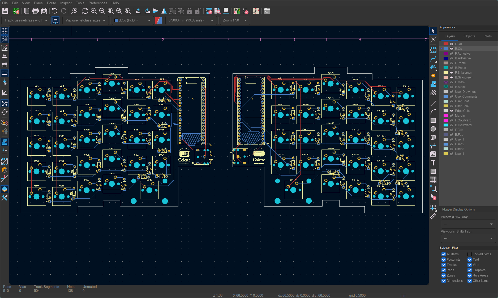

# Colette

A keyboard designed to be ergonomic, clean, convenient, maintainable, and versatile.
It is optimized for English, but can type every character supported by the US International layout (though it's not followed or fully required for basic usage.)
By default, it uses Colemak Mod-DH with a few changes to punctuation.

I made this keyboard to get more experience building hardware and enable a more cohesive coding environment.
I also wanted it to be good at typing text as well and have support for similar languages to english like French,
Spanish, and German.

* Keyboard Maintainer: [Hazel Viswanath](https://github.com/transdryad)
* Hardware Supported: Colette PCB, RPi/Orpheus Pico v1, Cherry MX keys, standard TRS jack

# Software used:
Kicad, Pycharm, FreeCAD, QMK, and Keyboard-Layout-Editor.com

# Firmware:
To compile & flash formware, install qmk system-wide and run bf.sh.
When it's "waiting for drive," plug in while pressing the BOOTSEL button on the PICO.
WARNING: the script will delete qmk firmware monorepo tree.
Backup any changes.

# BOM

| Part                      | Quantity | Proposed Sourcing Link                                                                        |
|:--------------------------|:---------|:----------------------------------------------------------------------------------------------|
| PCBs                      | 2        | https://jlcpcb.com                                                                            |
| KeySwitches               | 58       | https://mechanicalkeyboards.com/products/cherry-mx2a-brown-55g-tactile?variant=48020838351148 |
| Keycaps                   | ~58      | https://www.amazon.com/YMDK-Profile-Keyset-Mechanical-Keyboard/dp/B07S18VCDN?th=1             |
| Diodes                    | 58       | https://www.digikey.com/en/products/detail/onsemi/1N4148/458603                               |
| TRS Jacks                 | 2        | https://www.digikey.com/en/products/detail/same-sky-formerly-cui-devices/SJ1-3523N/738689     |
| TRS Cables                | 1        | https://www.mycablemart.com/store/cart.php?m=product_detail&p=9040                            |
| Orpheus Picos             | 2        | Hack Club?                                                                                    |
| M3x16mm Screws            | 8        | ? - would these and one below be purchased or sent from HQ?                                   |
| M3x5mx4mm headset inserts | 8        | same as above                                                                                 |
| Case                      | 4 parts  | Printed on printing legion?                                                                   |
